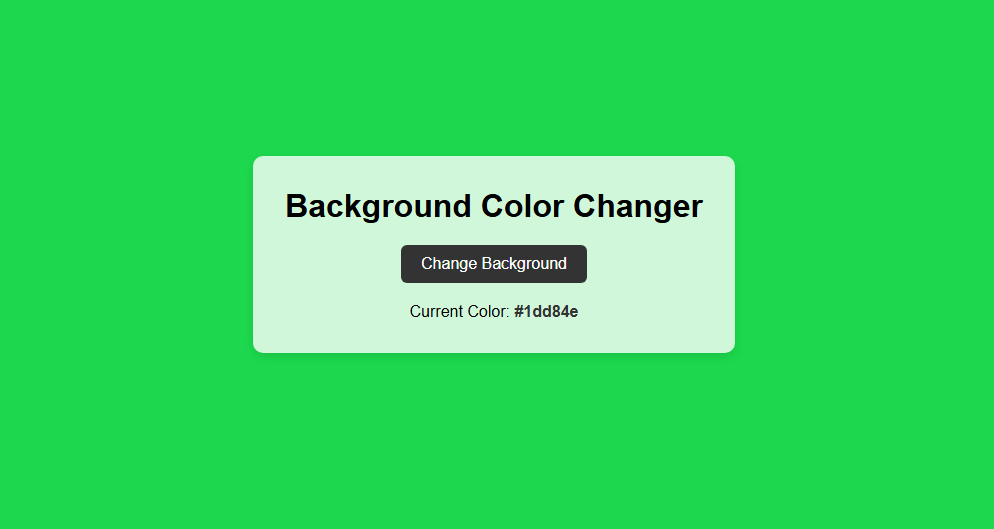

# 🎨 Background Color Changer Website

This is a simple and interactive web project that allows users to change the background color of the webpage to a random color every time they click a button. It also displays the current color code on the screen.

---

## 📌 Features

- 🎲 Random background color generator
- 🔄 Smooth background transition
- 🌐 Responsive and clean UI
- 🔤 Displays current hex color code

---

## 🛠️ Built With

- ✅ HTML5
- ✅ CSS3
- ✅ JavaScript (Vanilla JS)

---

## 🚀 How to Run This Project

1. **Clone or download** this repository to your local machine.
2. Open the `index.html` file in your browser.
3. Click on the **"Change Background"** button to see the magic!

---

## 📸 Screenshot

> 💡 You can take a screenshot of the project and name it `screenshot.png` to show it here.

---

## 📚 Learning Purpose

This project is great for:

- Practicing DOM manipulation
- Learning how to generate random values
- Using CSS transitions
- Building beginner-friendly mini-projects

---

## 🧑‍💻 Author

- Name: **Anshu Kohar**
- GitHub: [@yourusername](https://github.com/yourusername)

---

## ✅ License

This project is open-source and free to use.
